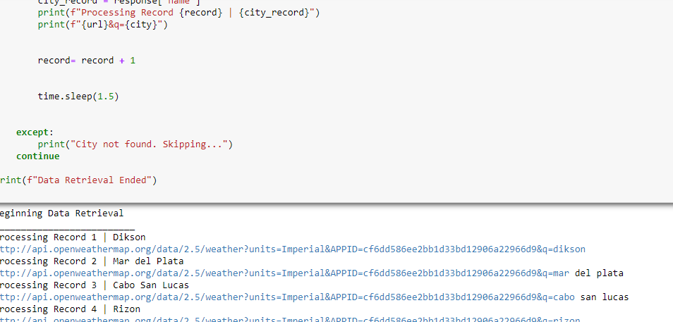
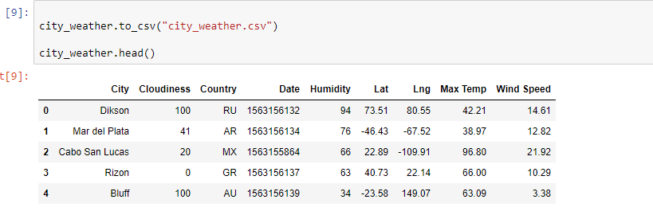
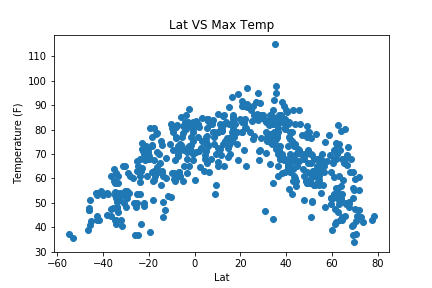
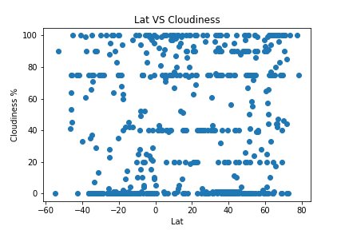

# Latitude weather analysis
Built a series of scatter plots to showcase the following relationships:

Temperature (F) vs. Latitude
Humidity (%) vs. Latitude
Cloudiness (%) vs. Latitude
Wind Speed (mph) vs. Latitude

Randomly selected over 500 unique cities based on latitude and longitude.
Performed a weather check on each of the cities using a series of successive API calls.
Included a print log of each city as it was being processed with the city number and city name.
Saved both a CSV of all data retrieved and png images for each scatter plot.

Used a Jupyter notebook.
Used the Matplotlib or Pandas plotting libraries.

  

  

